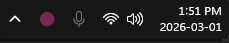
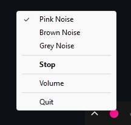
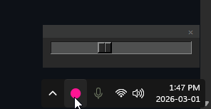

# Hush

**Background noise for Windows. Lives in your tray. Asks nothing of you.**

Pink noise, brown noise, or grey noise — pick one, set your volume, and forget it exists. No browser tab to babysit. No account to create. No internet required. Just a small icon near your clock quietly doing its job.

---

## Why Hush?

Every other option has a catch.

Browser-based players die the moment you close the tab or your computer goes to sleep. Spotify and YouTube need an internet connection and burn a whole browser process. Fancy desktop apps come loaded with EQ curves, sleep timers, and settings menus you'll never touch. iOS-only apps are useless on your work machine.

Hush is the thing you install once and never think about again.

---

## Features

- **Three noise types** — Pink (classic 1/f focus noise), Brown (deeper, rumbling, great for ADHD and sleep), and Grey (perceptually flat, the audiophile choice)
- **System tray only** — no window, no taskbar clutter, zero screen real estate used
- **Volume slider** — accessible from the tray menu, range tuned for comfortable background levels
- **Remembers your settings** — volume is saved to the Windows registry and restored on next launch
- **Single or double-click** — single-click the tray icon to play/pause; double-click to open the volume slider
- **Smooth fade in/out** — audio crossfades on play and pause so it never jolts you
- **Seamless looping** — 30-minute audio files with baked-in crossfades; the loop point is inaudible
- **Completely offline** — no network calls, ever
- **No telemetry, no accounts, no ads**
- **Tiny footprint** — low CPU, low memory

---

## Screenshots

The icon lives next to your clock. That's the whole UI.

**Single-click** the icon to toggle play/pause. Bright = playing, dim = paused.

 

Right-click for the menu — pick your noise type, play/pause, or adjust volume.



**Double-click** the icon to open the volume slider.



---

## Running from Source

**Requirements:** Python 3.10+

```bat
python -m venv venv
venv\Scripts\activate
pip install pystray Pillow numpy sounddevice soundfile
python hush.py
```

The `.flac` audio files must be in the same directory as `hush.py`.

---

## Packaging as a Standalone `.exe`

```bat
pip install pyinstaller
pyinstaller --noconsole --onefile ^
  --add-data "pink_noise.flac;." ^
  --add-data "brown_noise.flac;." ^
  --add-data "grey_noise.flac;." ^
  hush.py
```

Output lands in `dist\hush.exe`. No Python installation required on the target machine.

---

## Auto-Start with Windows

To have Hush start automatically when you log in, drop a shortcut to `hush.exe` (or `hush.py`) into the Startup folder:

```
%APPDATA%\Microsoft\Windows\Start Menu\Programs\Startup
```

Press `Win + R`, paste that path, and drag a shortcut in.

---

## Keeping the Tray Icon Visible

Windows hides new tray icons behind the `^` overflow arrow by default. To pin it next to the clock:

1. Right-click the taskbar → **Taskbar settings**
2. Scroll to **Other system tray icons**
3. Find **Hush** and toggle it **On**

---

## Audio Files

The bundled `.flac` files are 30-minute stereo recordings at 44.1 kHz with a 10-second crossfade baked in at the loop point so the repeat is seamless.

To substitute your own audio:

```bat
ffmpeg -ss 120 -i source.webm -t 1800 -ac 2 -ar 44100 output.flac -y
```

Replace the appropriate `.flac` file and restart Hush.

---

## Dependencies

| Package | Purpose |
|---|---|
| `pystray` | System tray icon and menu |
| `Pillow` | Tray icon image rendering |
| `numpy` | Audio buffer math |
| `sounddevice` | Low-latency audio output via PortAudio |
| `soundfile` | FLAC file decoding |

---

## License

MIT
